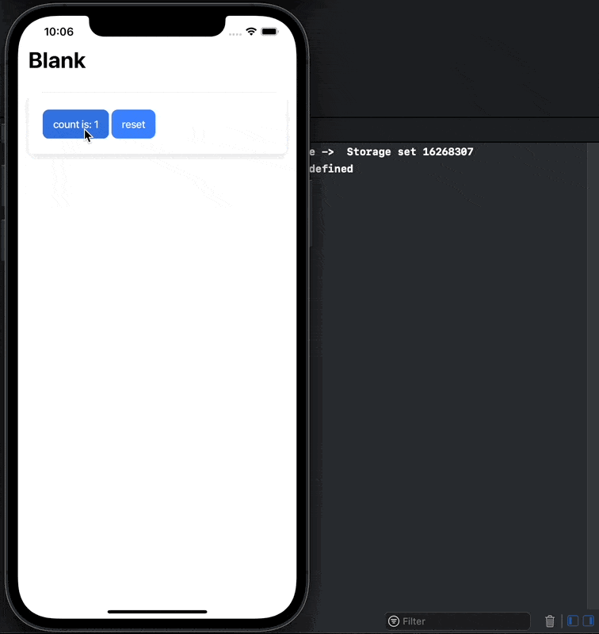

# Vue 3 Ionic Capacitor Preferences example



## Installation

```sh
pnpm add pinia pinia-plugin-persistedstate-2 @capacitor/core @capacitor/preferences
pnpm add @capacitor/cli -D
```

## Build and open iOS simulator

```sh
pnpm build && npx cap sync && npx cap open ios
```

## How it worked

set plugin custom `storage` option :

```ts
createPersistedStatePlugin({
  storage: {
    getItem: (key) => Preferences.get({ key }).then(({ value }) => value),
    removeItem: (key) => Preferences.remove({ key }),
    setItem: (key, value) => Preferences.set({ key, value }),
  },
})
```

is need prefix

```ts
const p = (_) => 'you_prefix-' + _

createPersistedStatePlugin({
  storage: {
    getItem: (key) =>
      Preferences.get({ key: p(key) }).then(({ value }) => value),
    removeItem: (key) => Preferences.remove({ key: p(key) }),
    setItem: (key, value) => Preferences.set({ key: p(key), value }),
  },
})
```
